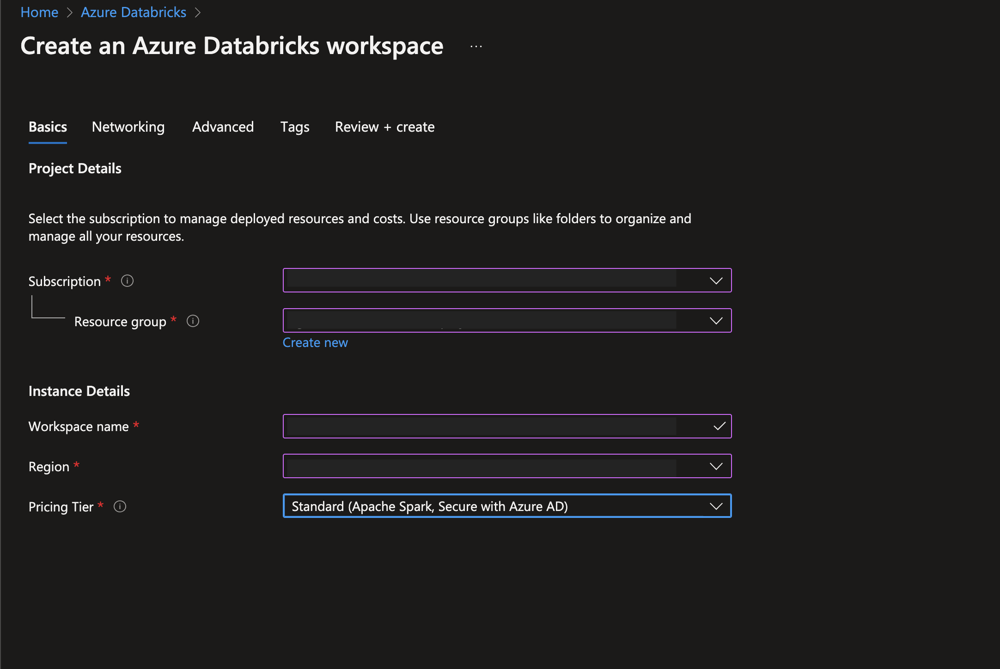
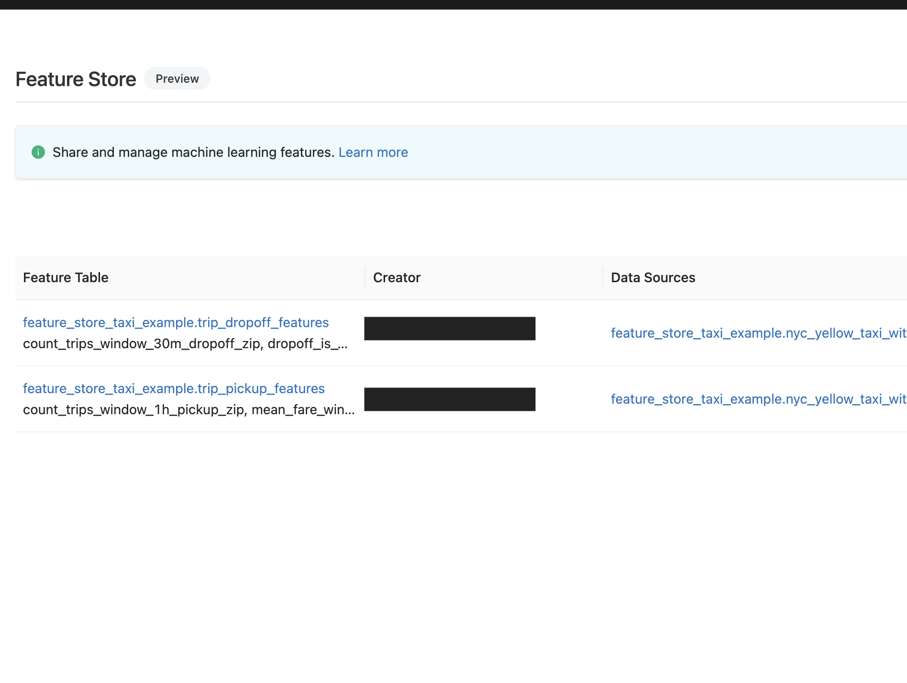

# Set up Databricks Feature Store

## Setup Azure Databricks instance

There are two main steps involved when creating a Databricks cluster:
  1. Creating the databricks infrastructure on Azure portal and
  2. Creating the databricks cluster itself.
Detailed below is the configurations settings and setup required for each the above steps.

Creation of the resources on Azure:

Creation of the cluster on Databricks:

Important to note that we are using the 10.2 ML Databricks Runtime. This contains APIs that allow us to use the built-in feature store relevant functionality.

Azure Databricks comes with Feature Store capabilities out of the box. Upon navigating to the Machine learning section on the left menu, one should be able ot view the 'Feature Store' section.

## Create sample data, feature views & features on Azure Databricks Feature Store

Firstly, download two notebooks from the Databricks feature store pages:

1. NYC Taxi Data Generator notebook - https://docs.microsoft.com/en-gb/azure/databricks/_static/notebooks/machine-learning/feature-store-taxi-example-dataset.html

Have a look at the troubleshooting section for help on running this notebook.

2. Feature Store Demo notebook(using NYC taxi data from above) - https://docs.microsoft.com/en-us/azure/databricks/_static/notebooks/machine-learning/feature-store-taxi-example.html

Once you run both these notebooks, you can go to the 'Feature Store' section to find the newly created feature views.

### Troubleshooting

You may run into an error while running the last cell to generate the data frame in the data generator notebook, that looks like this

To solve this, change line 23 in the `push_zipcode_to_executors` helper function in Cell 5 from ` search = SearchEngine(db_file_dir=target_dir) ` to ` search = SearchEngine() `

