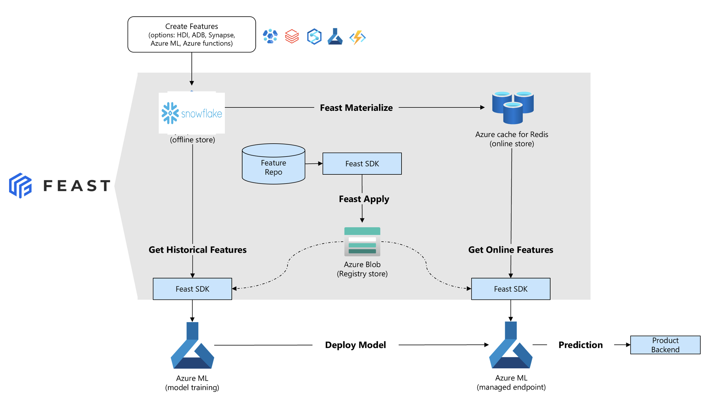
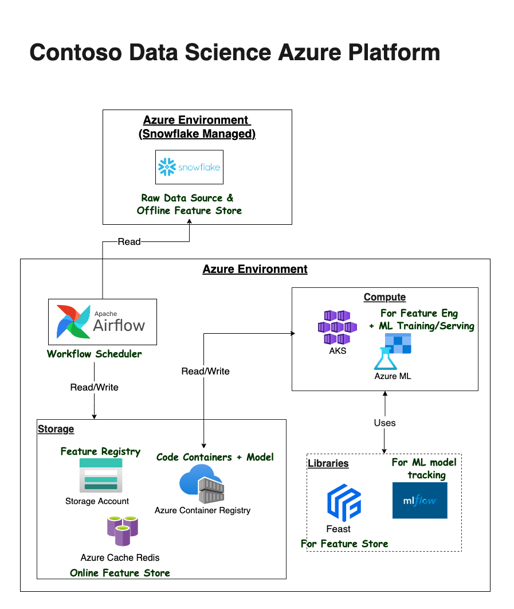
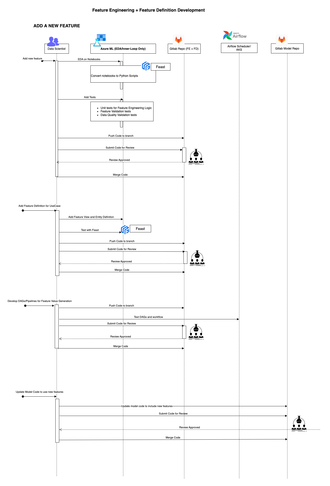
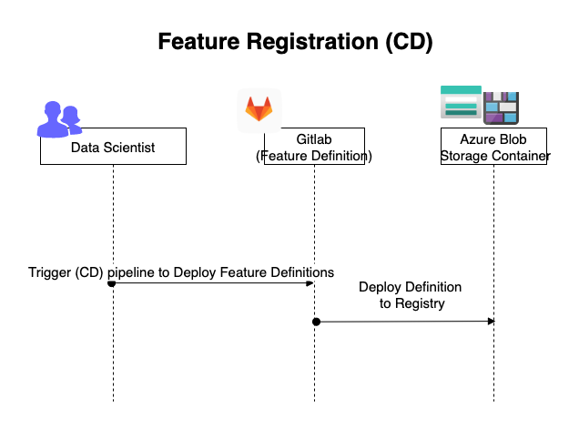
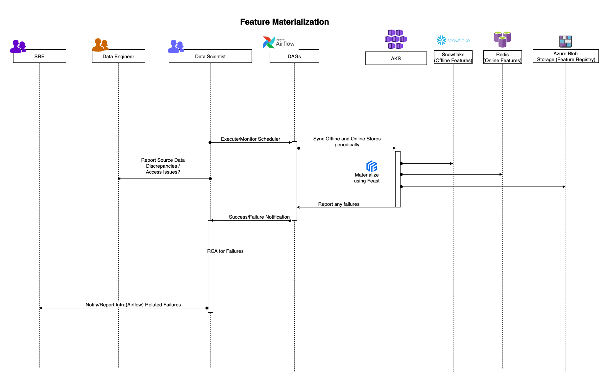
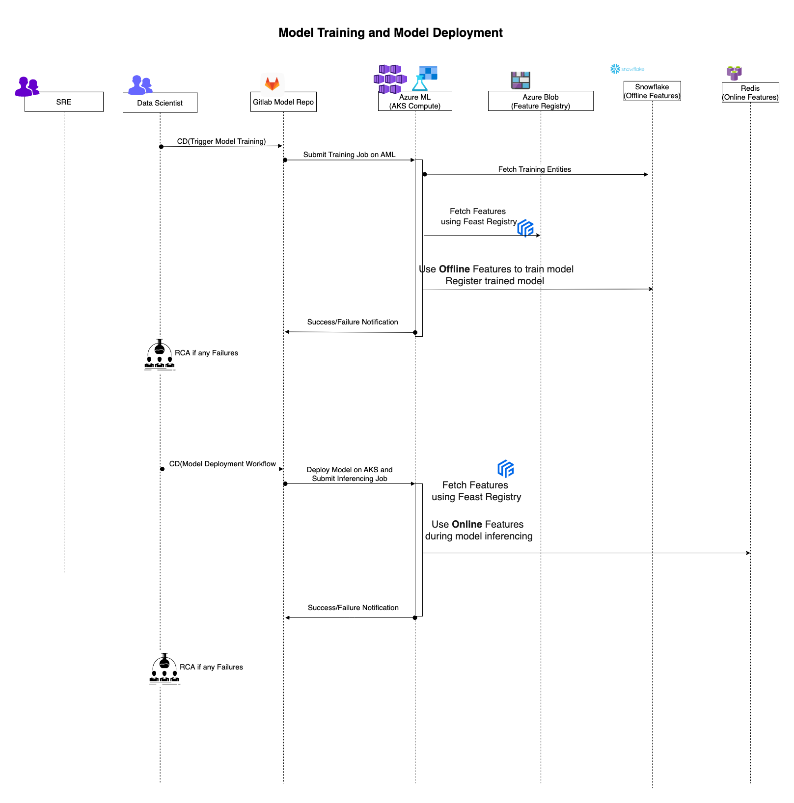

# Feature Store using Feast in Azure

## Overview

An end-to-end "Credit Risk Model" use case from Feature Engineering to Model Inferencing workflow using **Feast** as the feature store and **Azure** as the main cloud provider.

The repository includes:
 - infrastructure setup guidelines including airflow, gitlab runner and azure services
 - notebooks for data scientists to be used during inner-loop/EDA/FE
 - feature definition and materialization code
 - model training and inferencing code using features from Feast registry
 - gitlab workflows/pipelines for feature registration, model training and deployment to Azure
 - airflow dags for periodic feature materialization

## Data, Tools and Technologies
- Case Study: [Home Credit Risk Model](https://www.kaggle.com/c/home-credit-default-risk)
- Dataset: https://www.kaggle.com/competitions/home-credit-default-risk/data
- Cloud Provider: **Azure**
- Storage Services:
    - **Snowflake** (on Azure) for offline feature storage
    - Azure **Redis Cache** for online feature store
    - Azure Storage Account Blob Containers for Feature Metadata Registry
- Compute Services:
    - **Azure Machine Learning** Compute Instances for Notebooks (Inner-loop/EDA for Data Scientists)
    - **Azure Kubernetes** Cluster as training and inference compute on Azure Machine Learning Service (Staging and Production compute)
- Libraries:
    - **Feast** - open-source feature store library
    - Azure Feast Provider - open-source azure provider for Feast
- Orchestrators
    - **Airflow** for materializing the features between Snowflake and Redis
    - **Gitlab** CI/CD for Feature Registration, Model Training and Deployment

## Getting started

- Load your data into snowflake database [snowflake scripts](./snowflake-scripts/)
- Azure Infrastructure Setup [infra guide](./docs/infrastructure-setup.md)
- Gitlab Runner in Azure [gitlab](./docs/gitlab-runner.md)
- Airflow in Azure
    - [vm](./docs/airflow-setup.md)
    - [aks](./docs/airflow-on-aks-setup.md)
- How to build and run the Credit-Risk-Model use case workflows? [workflow guide](./docs/workflows/)
- How to sync your features between offline (snowflake) and online store (redis)? [Feature Materialization](./docs/materialization.md)
- Inner loop/EDA - [Notebooks](./notebooks/)
- Design Docs:
    - [Repository Structure with Feature Stores]()
    - [Unit Testing with Feature Stores]()
    - [Azure ML Compute Tradeoff](./docs/training-compute-tradeoffs.md)

### Repository Structure

- Logic Code:
    - Feature Store Configuration - [config](./feature_repo/dev/feature_store.yaml)
    - Feature Definition - [feature_repo](./feature_repo/scripts/feature_definitions.py)
    - Feature Materialization - [materialize](./scripts/airflow_materialize/materialization.py)
    - Model Training and Registration - [model train](./risk_model/)
    - Model Deployment - [model deploy](./risk_model/)
- Pipelines
    - [Feature Registration](./pipelines/.feature-definitions-cd.yml)
    - [Feature Materialization](./docs/materialization.md)
    - [Attach AKS Cluster as Compute Target to Azure ML](./pipelines/.attach-aks-compute.yml)
    - [Model Training and Registration](./pipelines/.risk-model-sdk-ci.yml)
    - [Model Deployment](./pipelines/.risk-model-sdk-cd.yml)

## Architecture

### Generic Feast Architecture

## Workflows

### Add a new Feature using Feature Store (CI)

### Feature Definition Registration (CD)

### Feature Materialization (Sync between offline and online store)

### Feature Consumption during Model Training and Serving

