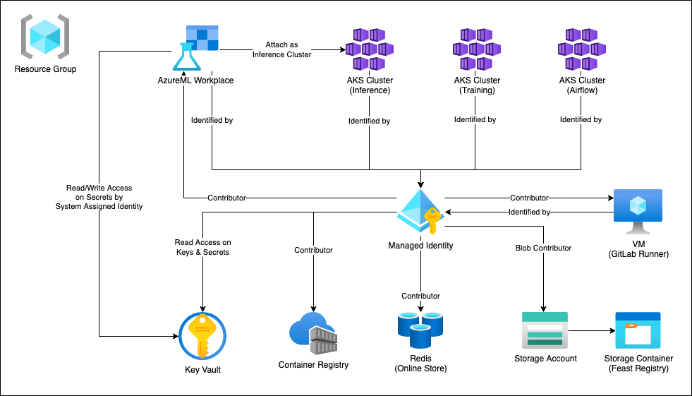

# Infrastructure Setup by Terraform

> If you want to set up infrastructure manually, please follow the guide here: [Infrastructure Setup](./infrastructure-setup.md).

This directory provides the Infrastructure as Code (IAC) for easy setup on cloud compute and storage resources required to run all feature store workflows described in this repository.

## Content Table

---

- [Overview](#overview)
- [Usage of IAC](#usage-of-iac)
  - [Module Structure](#module-structure)
  - [Usage of Variables](#usage-of-variables)
  - [Usage of Locals](#usage-of-locals)
  - [Azure Authentication & Authorization](#azure-authentication--authorization)
- [Step-by-Step Infra Setup](#step-by-step-infra-setup)
  - [For IAC](#for-iac)
  - [For Remaining Infra](#for-remaining-infra)
- [Constraints & Limitations](#constraints--limitations)
  - [Default Infrastructure Configurations](#default-infrastructure-configurations)
  - [Remote State Management](#remote-state-management)
  - [Location of Resources](#location-of-resources)
  - [Creation of Secret KV pairs in key vault](#creation-of-secret-kv-pairs-in-key-vault)

## Overview

---

### Resources included



The image above shows a high-level view of the infrastructure that will be
provisioned by this IAC.
There might be some extra resources such as additional resource groups and load balancers that will be created along the provisioning process.
As those are not directly managed by this IAC, they will not be discussed in this document.

In short this IAC is managing the following resources.

- Resource Group
  - Key Vault
  - Container Registry
  - Redis Cache (used for online store)
  - Storage Account
    - One Storage Container used for feature registry
  - Azure Kubernetes Services (AKS)
    - Three managed clusters used for inference, training, and airflow jobs
  - Virtual Machine
    - One instance used for GitLab runner
  - AzureML Workspace
    - A system assigned identity (auto created)
      - Granted with access on Key Vault with All permissions
    - An inference cluster (point to one of the AKS cluster above)
  - Managed Identity
    - Assigned with built-in Contributor Role on
      - Container Registry
      - Redis Cache
      - GitLab Runner VM
      - Three AKS clusters
      - AzureML Workspace
    - Assigned as identity to
      - GitLab Runner VM
      - Three AKS clusters
      - AzureML Workspace
    - Granted with access on
      - Key Vault with Read (`Read, List`) permissions

### Resources not included

- Snowflake account and databases (used as offline store)
- GitLab runner registration and pipeline setup on GitLab
- Attached cluster (use for training) creation in AzureML Workspace
- Airflow installation

Each of the above setup will be explained later in this document.

## Usage of IAC

---

1. ### Test

this is a test

### Module Structure

Each of the resource is managed as a module in this IAC which will be included and orchestrated by the root module.
Each of the modules contains four scripts:

- `main.tf` declares all resource and data blocks, together with terraform settings and provider information when applicable.

- `locals.tf` declares constant values and patterns that will be used in multiple places within the module such as resource namings.

- `variables.tf` declares variables that are required to provision the resources such as the location of the resource, the prefix of resource names, or SKU of certain resource types. Many of the variables have default values, please cutomize them as needed.

    > Please note that only attributes that will not affect the overall infrastructure topoloy are customizable and defined as varaibles in this IAC.
    Changing the type of resources or adding extra connections (such as additional IP configuration for VM) cannot be done merely by chaning the variables.

- `output.tf` declares the output of the module. This IAC use output values as a way to pass resource creation information around different modules. If not absolutely needed, DO NOT modify this file.

- (root module) `terraform.tfvars` declares the variables that need to be passed to terraform among different runs. Noted that this file is not complusory as variables can be passed in via multiple ways. ([Terraform Input Variables](https://www.terraform.io/language/values/variables))

In short, the overall structure is:

```code
infra
├── main.tf                 # root modules entry
├── variables.tf            # root modules input variable definition
├── terraform.tfvars        # root modules input variable values
└── modules
    ├── azure_ml
    │   ├── locals.tf       # child module constants definition
    │   ├── main.tf         # child module entry
    │   ├── output.tf       # child module output variables definition
    │   └── variables.tf    # child modules input variable definition
    ├── container_registry
    │   └── ...
    └── <other modules ...>
```

### Usage of Variables

Most of the variables are defined in both child modules and root module for ease of use. You can check the `variables.tf` in the root module directory for all available variables in this IAC.

Required variables are those without a default value. These variables must be set when applying changes. For other variables, only set them when the default values cannot fulfil your needs. Please set the variable values either through `terraform.tfvars` in the root module or through command line directly, and do not modify `variables.tf` file.

### Usage of Locals

Most of the locals defined in this IAC are naming patterns that are used across resources. They are not billing-critical, but it will affect your resource naming or even some domain names (such as for redis cache service) during creation.

If you want to customize some of your resource naming due to compliance requirement or any other reasons, please go to each child module and directly modify in the `local.tf` files.

### Azure Authentication & Authorization

If your runtime envrionment has `azure-cli` installed and authenticated, you directly use `azure-cli` authentication to run this IAC without any other additional settings.

If you would like to use another subscription id or a service principal identity, you can follow the steps below in root module directory:

1. De-comment `client_secret`, `client_id`, `tenant_id`, and `subscription_id` in `variables.tf`.
1. De-comment the same four field in the `provider` block for azure in `main.tf`.
1. Pass intended values to these four variables either through command line or `terraform.tfvars`.

If you want to authenticate through other methods such as a client certificate or by utilizing environment variables, you can follow the documentation here: [Terraform Azure Provider Authentication](https://registry.terraform.io/providers/hashicorp/azurerm/3.12.0/docs/guides/service_principal_client_certificate).

> Please note that in order to successfully provision all resources successfully, the authenticated identity is recommended to have the `Owenr` permission on the subscription as there are RBAC role assignment happening. If `Owner` is not granted to the identity, please check and make sure that you are able to grant permissions to those resources affected (through other RBAC roles).

## Step-by-Step Infra Setup

---

This section will illustrate how you can quickly setup your infrastructure without many customizations. If you want to learn more about the usage details, please visit the former sections.

### For IAC

1. Go to root module directory from you repo root folder: `cd infra`.
1. Authenticate your `azure-cli`, you can skip this step if you already log in.
1. Set/modify values of compulsory/optional variables in `terraform.tfvars`.
1. Run `terraform init`.
1. Run `terraform apply`, and type `yes` followed by `enter` key when it prompts.
1. Wait for provisioning completes.

### For Remaining Infra

1. Snowflake account and databases (used as offline store)
    - Create you own Snowflake account.
    - Load data into snowflake database: [Snowflake Scripts](../snowflake-scripts/)

1. GitLab runner registration and pipeline setup on GitLab
    - Follow the guide here: [GitLab Runner Setup](./gitlab-runner.md)
    - You can skip the step to create the vm as it is created in the IAC.
        > Please Note that in our IAC, the VM is created with password authentication enabled and without an SSH key. If you want to change this behavior for security reason, please go to `vm_gitlab_runner` child module to modify the settings.

1. Attached cluster (use for training) creation in AzureML Workspace
    - Follow the guide here: [AKS Setup for AzureML Compute](./workflows/aml-compute-setup.md). Please use the AKS cluster created for training purpose, you can find the cluster details from your resource group on Azure portal.
        > Please note this guide is useful for creating a compute target of an `Attached Cluster` type in AzureML Workspace, which shall be primarily used for training. For `Inference Cluster`, a link between AzureML Workspace and our AKS cluster is already created in IAC. More information can be found here: [AzureML: Create & Managed Compute Resources](https://docs.microsoft.com/en-us/azure/machine-learning/how-to-create-attach-compute-studio#attached-compute)

1. Airflow installation on AKS
    - Follow the guide here: [Airflow installation on AKS](./airflow-on-aks-setup.md). Please use the AKS cluster created for airflow purpose, you can find the cluster details from your resource group on Azure portal.

## Constraints & Limitations

---

### Default Infrastructure Configurations

  Currently most of the infrastructure configurations are using "basic" SKU or cost-friendly settings to save bugets, which is sufficent in most of the development environment. If you would like a staging or even a production ready environment setup, do examine the available variables in `varaibles.tf` in the root module and customize the settings as desired.

### Remote State Management

  Currently state of this IAC is only managed locally which means different runs on multiple machines will result in multiple infrastructure stacks. If your team would like to have a centralized place for remote state management, you will find following resource helpful:

- [Store Terraform State in Azure Storage](https://docs.microsoft.com/en-us/azure/developer/terraform/store-state-in-azure-storage?tabs=azure-cli)
- [Terraform Backend Settings](https://www.terraform.io/language/settings/backends/azurerm)

### Location of Resources

  Currently all resources share the same location during provisioning. But do pay attention that not all Azure resources are available in all regions and locations. Before you run this IAC, you may want to check whether all resources mentioned above are available in your desired location.

  In case you want to customize the location for certain resources, you may want to modify `main.tf` in the root module:
    1. Find the child module where your resource locates.
    1. Find the `location` attributed in the corresponding module block.
    1. Change the value to your desired one, you may want to create a separate input variable definition if the same location is used in multiple places.

### Creation of Secret KV pairs in key vault

  Currently adding kv pairs in key vault is not supported by this IAC, as this process may involve granting temporary read/write access (need to be revoked after the kv pairs are created for security concerns) to the principal that is used to run this provisioning. Besides, some of the secret values may not be known as the time when running this IAC and may be prone to change over time.

  1. Using Azure CLI

      One way to create secrets is to use azure CLI (see [Azure CLI Create Secrets](https://docs.microsoft.com/en-us/cli/azure/keyvault/secret?view=azure-cli-latest#az-keyvault-secret-set)).

      ```code
      az keyvault secret set --name MySecretName --vault-name MyKeyVault --value MyVault
      ```

  1. Using Terraform IAC

        Create key vault secrets iteratively from variables:

        ```code
        resource "azurerm_key_vault_secret" "kv_secret" {
          for_each     = var.kv_secrets
          name         = each.key
          value        = each.value
          key_vault_id = module.key_vault.key_vault_id
        }
        ```

        Create key vault secret from other modules' output:

        ```code
        resource "azurerm_key_vault_secret" "kv_secret_redis_conn_string" {
          name         = "REDIS-CONN-STRING"
          value        = module.redis_online_store.redis_conn_string
          key_vault_id = module.key_vault.key_vault_id
        }
        ```

        Besides, don't forget to grant write access to your principal, you can add this block in the `key_vault` module or grant through the web portal after the key vault is created.

        ```code
        resource "azurerm_key_vault_access_policy" "key_vault_access_policy_for_pincipal" {
          key_vault_id = azurerm_key_vault.key_vault.id
          tenant_id    = data.azurerm_client_config.current.tenant_id
          object_id    = data.azurerm_client_config.current.object_id

          secret_permissions = ["Get", "List", "Set", "Delete"]
        }
        ```
