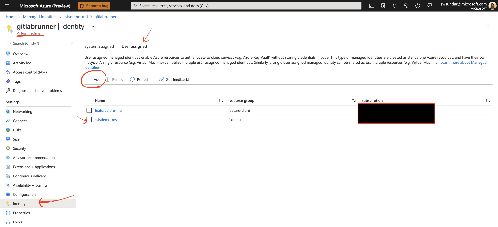
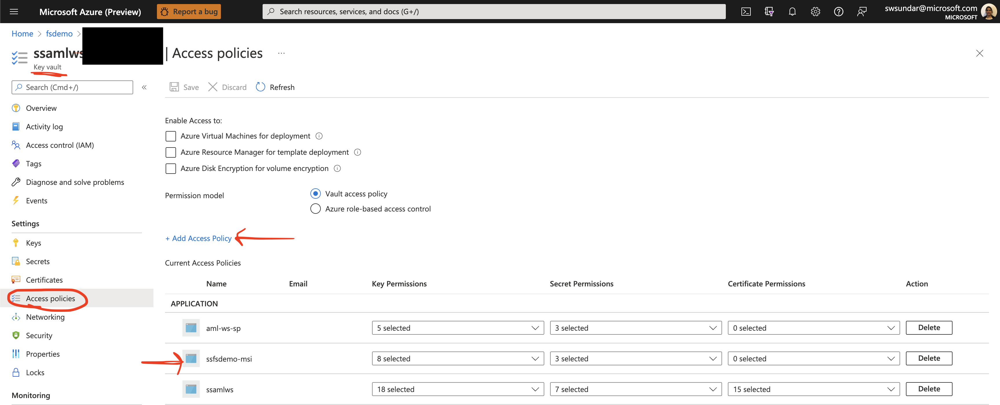
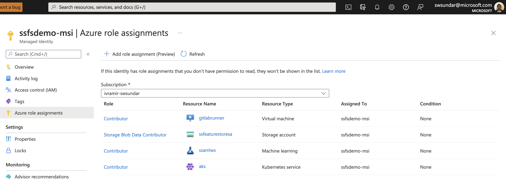
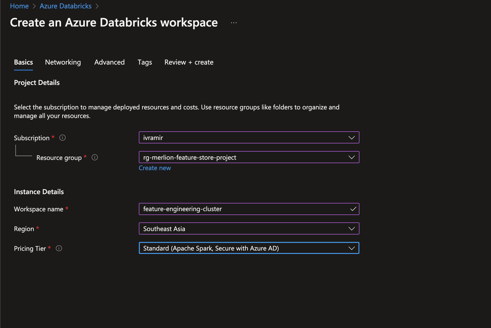
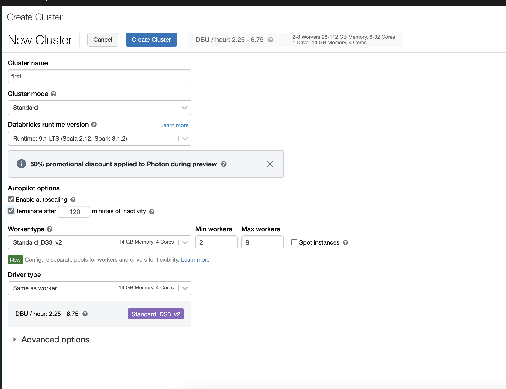

# Infrastructure Setup

Following are the Azure services and other infrastructure setup required:

1. Azure Resource Group
2. Azure Key Vault
3. Azure Storage Account
4. Azure Machine Learning Workspace
5. Azure Redis Cache
6. Azure Container Registry
7. Azure Kubernetes Service Cluster
8. User Managed Identity
9. Service Principal
10. Snowflake Account (on Azure, managed by Snowflake)
11. Virtual Machine for Gitlab Runner and Airflow (if setup on a VM)

## Configuration Details

Create all resources in the same or closer regions where possible using Azure Portal or CLI or preferred IaC tool.

## Access Privileges for Managed Identity (MI)

#### On the **Gitlab Runner Virtual Machine** Resource:
   1. Go to **"Identity"** and add your MI to the authenticate to other Azure services from the VM using the MI
    
   2. Next, Add **Role Assignment**: Add a "Contributor Role" to the MI

#### On the **Key Vault** Resource:
   1. Add **Trust Policy** for the MI to be able to read secrets
    

#### On the **Storage Account** Resource:
   Add Role Assignment: Storage Blob Data Contributor role for MI

#### Add Role Assignment: Contributor Role for MI for following resources:
   - Azure Machine Learning Workspace
   - on every Azure Kubernetes Cluster Resource
   - Azure Redis Cache Resource
   - Azure Storage Account

## Access Privileges for Service Principal

#### On the **Key Vault** Resource:
   Add **Trust Policy** for the Service Principal to be able to read secrets
   

## Storage Account

Create a Blob container in Azure Storage Account to store feature-registry db file
1. Go to Azure Portal -> Storage Account -> Containers
2. Click Create
3. Provide a name and choose the access (default is fine)
4. Click Create

## Gitlab Global Variables

Create the following variables in your Gitlab CI/CD Settings and ensure you reference the same variables in the pipelines

1. SUBSCRIPTION_ID: Subscription ID of AML Workspace
2. RESOURCE_GROUP: Resource Group Name
3. KEYVAULT_NAME: Azure Keyvault Name
4. MANAGED_IDENTITY: Full Resource Id of User Assigned Managed Identity
5. USER_MSI_CLIENT_ID: Client ID of the User Assigned Managed Identity
6. AML_WORKSPACE_NAME: Azure ML Workspace Name
7. AML_COMPUTE_NAME: AML Compute Target Name
8. AKS_RESOURCE_ID: AKS Compute Cluster Resource ID

## Azure Kubernetes Cluster

1. AKS for Model Training
   -  Refer [setup](training-compute-tradeoffs.md) doc and [workflow](./workflows/aml-compute-setup.md) doc
2. AKS for Model Inferencing
   - Refer [setup](./training-compute-tradeoffs.md) doc
3. AKS for Airflow
  - Refer [setup](airflow-on-aks-setup.md)

## Azure Redis

Refer to the detailed [document](./redis-online-store-setup.md) on how to setup your Redis cluster and the required configurations

## [OPTIONAL] Databricks Cluster

There are two main steps involved when creating a Databricks cluster:
  1. Creating the databricks infrastructure on Azure portal and
  2. Creating the databricks cluster itself.
Detailed below is the configurations settings and setup required for each the above steps.

Creation of the resources on Azure:

Creation of the cluster on Databricks:

