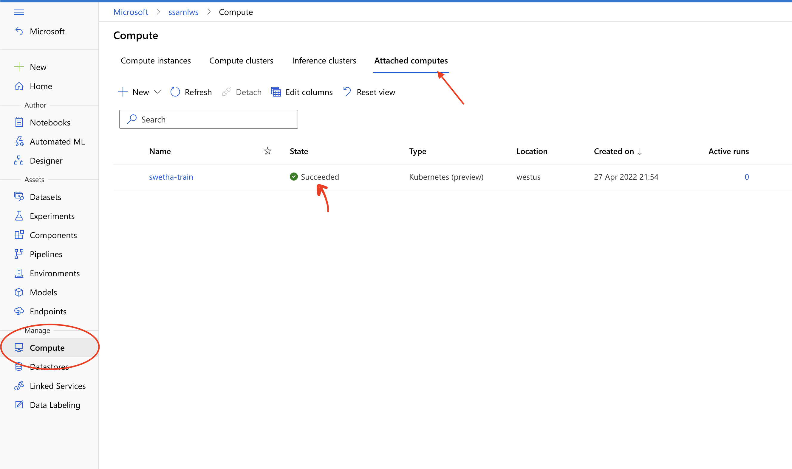

# Azure Machine Learning Compute Setup

## Overview
Azure Machine Learning offers many compute options and trade-offs between some of these options are listed in [Training Compute TradeOffs](../training-compute-tradeoffs.md) document.
This document, will go over the steps required to create and attach an AKS cluster as training compute target.

## Create an AKS Cluster for model training

The following guide provides detailed steps on how to create an AKS cluster suitable for the ML workload.
https://docs.microsoft.com/en-us/azure/machine-learning/how-to-create-attach-kubernetes?tabs=python%2Cakscreate

In addition, take note of the networking and credential management steps to be performed on the AKS cluster to allow the AML workspace to communicate with the AKS cluster.

## Attach an AKS Cluster for training

Once the AKS cluster is created and ready, run the following commands:

### Prerequisites

```bash
# Run the first three commands below once per subscription [Takes ~10 mins to complete]
az provider register --namespace Microsoft.KubernetesConfiguration

az provider register --namespace Microsoft.ContainerService

az feature register --namespace "Microsoft.ContainerService" --name "AKS-ExtensionManager"

# Ensure the azure cli has the k8s extension installed)
az extension add --name k8s-extension

# Run the following command for every new aks cluster you need attach to the AML workspace [Takes >10 mins to complete]

az k8s-extension create --name arcml-extension --extension-type Microsoft.AzureML.Kubernetes --config enableTraining=True --cluster-type managedClusters --cluster-name <CLUSTER_NAME> --resource-group <RESOURCE_GROUP_NAME> --scope cluster --auto-upgrade-minor-version False
```

### Running Gitlab pipeline

1. Fetch and Add the AKS_RESOURCE_ID to your gitlab pipeline variables
2. Add a unique compute target name - AML_COMPUTE_NAME as gitlab local variable to use during the attachment
3. Ensure the above two variables are set in gitlab pipeline [attach-aks-compute.yml](../../pipelines/.attach-aks-compute.yml)
4. Manually trigger the pipeline from Gitlab or pushing code to the branch should auto-trigger the pipeline with the "Attach AKS Cluster" stage.

### Workflow Output

1. Go to Azure Portal -> Azure Machine Learning Resource -> Launch Studio
2. Choose Compute and you see the AKS cluster attached as training compute target as below:


