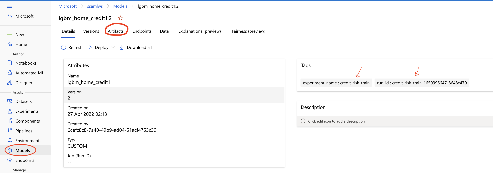
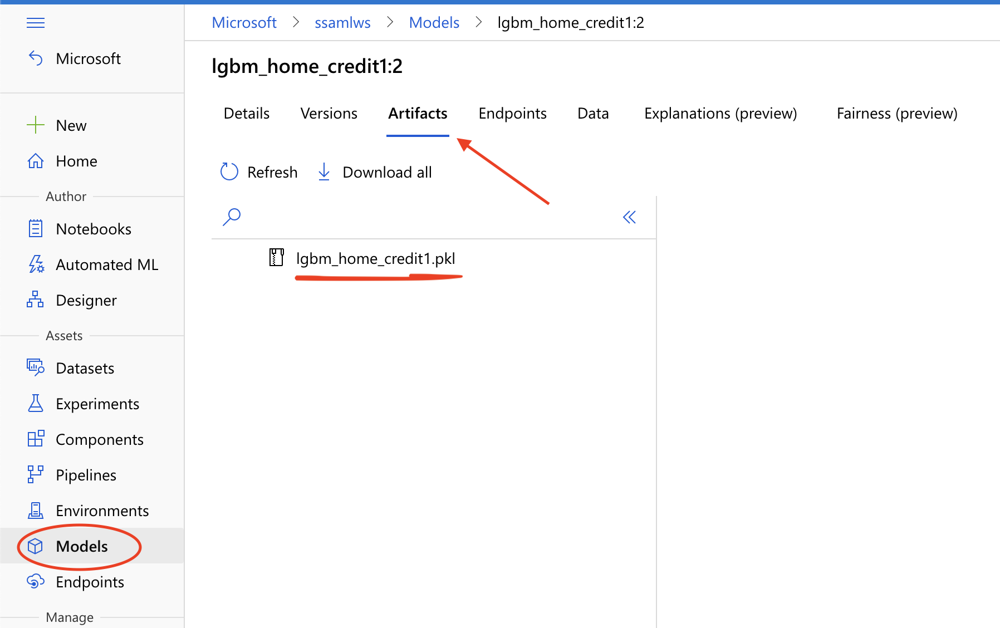

# Model Training and Registration in Azure Machine Learning

## Overview
This document outlines the steps required to train your model in Azure Machine Learning from vscode (for inner-loop development) and via gitlab pipelines (CI)

## Training Options Locally

You can use the CLI to kick-off a run from your VSCode or from Azure Cloud Shell

1. Add ml extension to your azure cli
```bash
az extension add -n azure-cli-ml
```

2. Login to your subscription
```bash
az login
```

3. Create a python virtual environment and install all necessary dependencies
```bash
virtualenv <VIRTUAL_ENV_NAME>
source <VIRTUAL_ENV_NAME>/bin/activate
pip install -r config/aml_requirements.txt
```
3. Submit a training job to a pre-existing compute target (should already be attached to the AML Workspace)
```bash
az ml run submit-script --ct <AKS_COMPUTE_TARGET_NAME> -e <EXPERIMENT_NAME> -g <RESOURCE_GROUP> -w <AML_WORKSPACE_NAME> --subscription-id <SUBSCRIPTION_ID>  --source-directory risk_model train.py
```
4. Output logs should be streaming; Alternatively track from Azure ML Workspace Studio for the triggered run

## Running the pipeline
Pipeline Script for Model training and Registration - [risk-model-sdk-ci.yml](../../pipelines/.risk-model-sdk-ci.yml)

### Prerequisite
 - Ensure that the compute target (aks cluster) is already attached and ready in the workspace. Refer to [doc](aml-compute-setup.md)

### Workflow
1. Pass in an AML Experiment name to use (will be created if one doesn't already exist in the workspace) as a gitlab pipeline variable (local to script)
2. Ensure you have the right Gitlab environment name and Gitlab runner tag
3. Committing pipeline changes to the repo should auto-trigger the pipeline in the said branch; else manually trigger a run from gitlab; The "Train and Register ML Model" stage should run and succeed.

### Workflow Output

1. Azure ML Run should succeed


2. Azure ML Model should be registered and pkl file available as a model artifact




